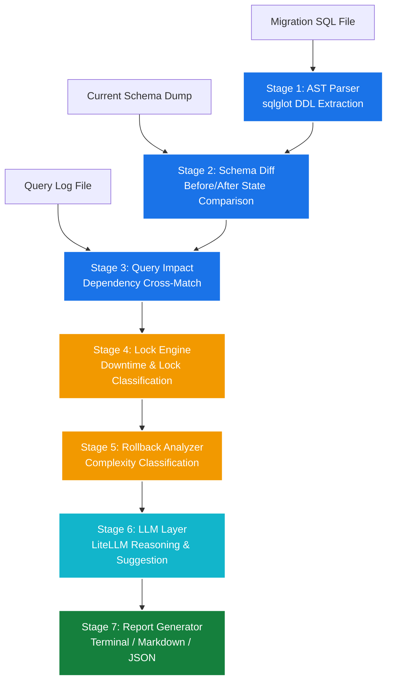

# 🧠 MigrationMind

> **AI-powered database migration risk analyzer.** Know exactly what will break, how long it'll take, and whether you can safely roll back — *before* you run a single query in production.

[](https://github.com/H8rsh100/MigrationMind/actions/workflows/ci.yml)
[](https://github.com/H8rsh100/MigrationMind/actions/workflows/migrationmind.yml)
[](https://www.python.org/)
[](LICENSE)
[](https://github.com/astral-sh/ruff)

---

## The Problem

Every engineering team that uses a relational database runs migrations. It is one of the **highest-risk operations** in the entire deployment lifecycle. A single bad migration can:

- 🔒 Lock a table for minutes on a high-traffic database, causing a full outage.
- 💥 Drop a column that 3 microservices are still reading.
- 🚫 Run irreversibly and corrupt data with no clean rollback path.
- ✅ Pass CI/CD checks completely fine and still destroy production.

The current state of the art is: a senior DBA manually reviews it, or you just run it and pray.

## What MigrationMind Does

MigrationMind takes three inputs:

1. **Migration file(s)** — SQL, Alembic, Flyway, or raw DDL
2. **Current schema dump** — your live schema snapshot
3. **Query log** *(optional)* — slow query log or query pattern file

It runs a **multi-stage analysis pipeline** and produces a structured risk report.

### Example

```bash
migrationmind analyze \
  --migration ./migrations/0042_add_user_index.sql \
  --schema ./schema_dump.sql \
  --queries ./slow_query_log.txt
```

```
MigrationMind Risk Report — 0042_add_user_index.sql
════════════════════════════════════════════════════

Risk Score: HIGH (74/100)

Operations detected: 3
  ✗ ALTER TABLE users ADD COLUMN last_active TIMESTAMP NOT NULL DEFAULT NOW()
    → Postgres 10 detected: full table rewrite required
    → Estimated lock duration: 4–12 minutes (table size: ~8M rows)
    → Rollback: safe (DROP COLUMN)

  ✗ DROP INDEX idx_users_email
    → 2 queries in your log depend on this index for performance
    → Rollback: safe (recreate index) but requires downtime

  ✓ CREATE TABLE audit_log (...)
    → No risk. New table, no dependencies.

Affected queries: 2
  → SELECT * FROM users WHERE email = ? (will lose index, 40–200x slowdown)
  → UPDATE users SET last_active = ? WHERE id = ? (blocks during table rewrite)

Rollback complexity: MEDIUM
  → All operations reversible but require 15–20 min window

Suggested safe rewrite:
  → Add column nullable first, backfill in batches, then add NOT NULL
  → Full rewrite plan: migration_0042_safe_rewrite.sql
```

## Architecture

MigrationMind runs DDL analysis sequentially across a series of specialized parsing, simulation, and estimation modules:



- **Stage 1 — Parse**: Extracts Abstract Syntax Trees (ASTs) of all DDL operations.
- **Stage 2 — Schema Diff**: Creates before/after schema models to detect removed or modified structures.
- **Stage 3 — Query Impact**: Cross-matches slow query logs against schema diffs to identify missing resources.
- **Stage 4 — Lock Engine**: Estimates lock severity and maximum downtime durations.
- **Stage 5 — Rollback**: Classifies the complexity and risk of reversing each change.
- **Stage 6 — LLM Layer**: Generates human-friendly explanations and suggests safe refactoring structures.
- **Stage 7 — Report**: Publishes findings to terminals, JSON payloads, or markdown documents.

## Installation

```bash
pip install migrationmind
```

Or from source:

```bash
git clone https://github.com/H8rsh100/MigrationMind.git
cd MigrationMind
pip install -e ".[dev]"
```

## Configuration

Copy `.env.example` to `.env` and fill in your values:

```bash
cp .env.example .env
```

```env
LITELLM_MODEL=gpt-4o
OPENAI_API_KEY=sk-...
MIGRATIONMIND_DIALECT=postgresql
MIGRATIONMIND_DB_VERSION=14
```

## CLI Commands

| Command | Description |
|---------|-------------|
| `migrationmind analyze` | Run the full analysis pipeline |
| `migrationmind init` | Scaffold a config file in the current project |
| `migrationmind history` | Show past analysis runs |

### `analyze` flags

| Flag | Default | Description |
|------|---------|-------------|
| `--migration` | required | Path to migration file |
| `--schema` | optional | Path to schema dump SQL |
| `--queries` | optional | Path to query log file |
| `--dialect` | `postgresql` | SQL dialect |
| `--db-version` | `14` | Database major version |
| `--output` | `terminal` | Output format: `terminal`, `json`, `markdown` |
| `--no-llm` | false | Skip LLM reasoning stage |

## CI/CD Integration

Drop the bundled GitHub Actions workflow into your repo:

```bash
cp .github/workflows/migrationmind.yml your-repo/.github/workflows/
```

Every PR that touches a migration file automatically gets a risk report posted as a PR comment.

## Why Not Flyway / Squawk / pganalyze?

| Tool | What it does | What's missing |
|------|-------------|----------------|
| Flyway / Liquibase | Migration runner | Zero risk analysis |
| Squawk | Postgres linter | Rule-based only, no query impact, no AI |
| pganalyze | Query monitoring | Post-deployment, not pre-deployment |
| Datadog / New Relic | Observability | Observability, not intelligence |

**MigrationMind** is the only tool combining AST parsing + schema context + query analysis + LLM reasoning into a pre-deployment risk report.

## Development

```bash
make install    # pip install -e ".[dev]"
make test       # pytest tests/
make lint       # ruff check .
make format     # ruff format .
make example    # run on bundled example migration
```

## License

MIT — see [LICENSE](LICENSE).
